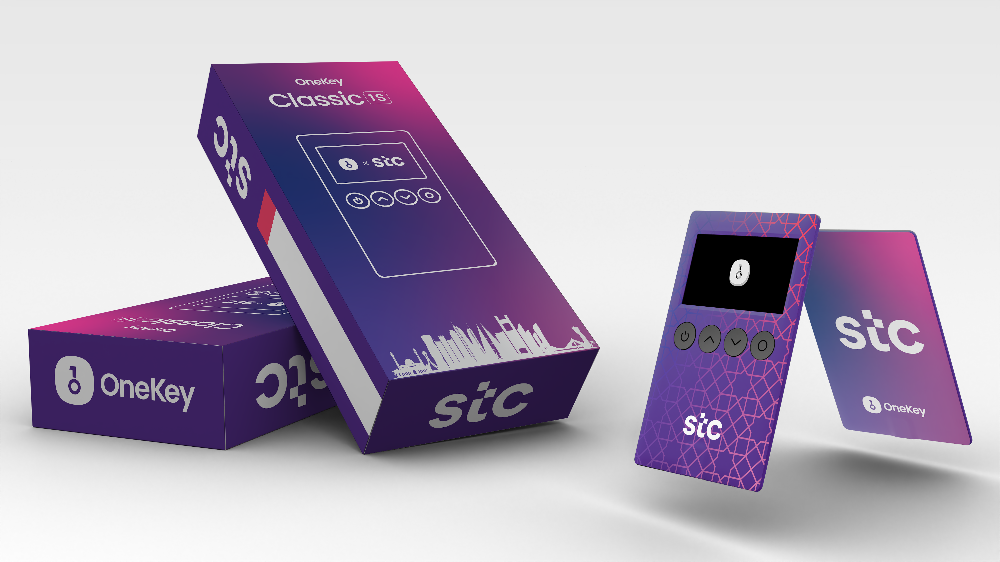
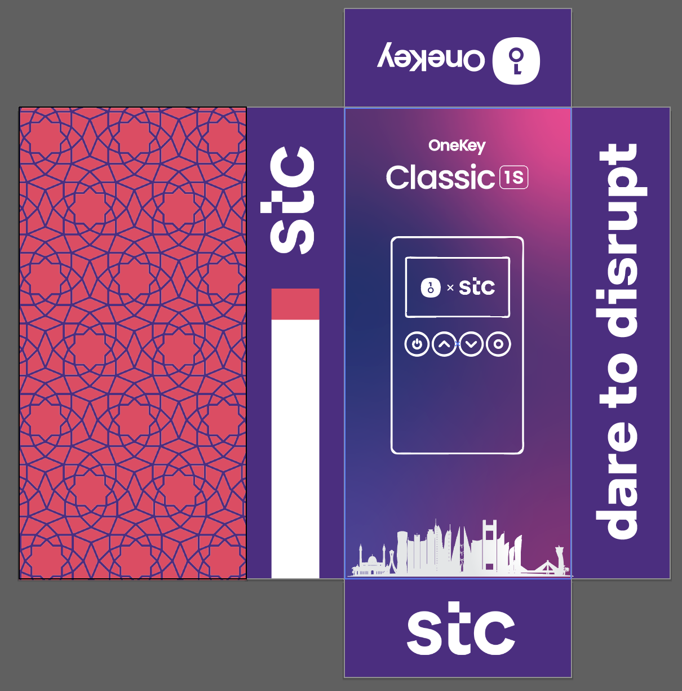
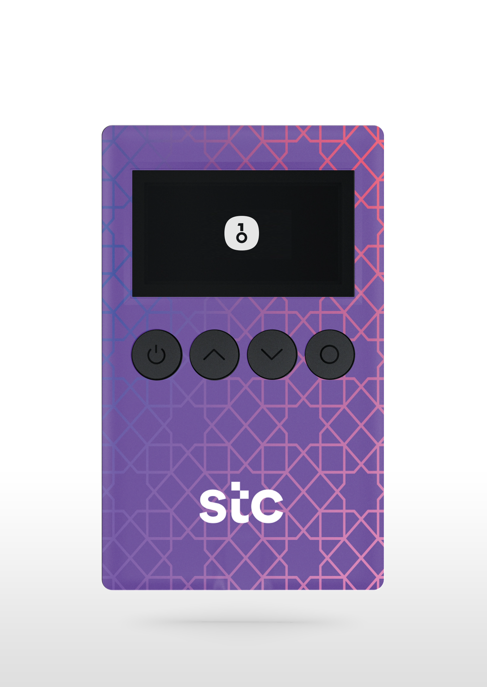
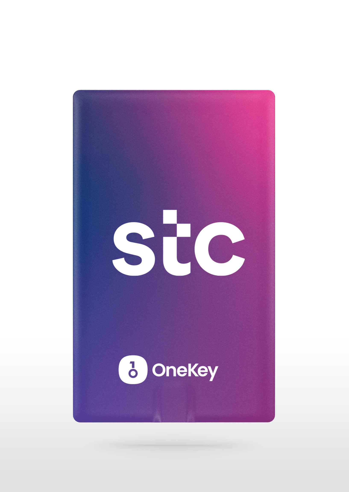

# stc Bahrain Branded OneKey Wallet - 2nd Version

This repository contains the design files for the stc Bahrain branded OneKey wallet (2nd Version).

The OneKey wallet is customized with stc Bahrain's visual identity to align with its brand presence in the region. The box showcases elements of Bahrain's cultural and architectural landmarks, most notably the Manama skyline, blending modern aesthetics with regional pride. The back of the box showcases Middle Eastern motifs. The rest of the box and the device use stc colours and style.

## Mockup

Below is a mockup of the OneKey wallet, featuring the stc Bahrain branding:

## Box Layout

The following image displays the layout of the box, incorporating stc Bahrain branding and the Manama skyline:

### Device Images

#### 1. Front View of the OneKey Device:

#### 2. Back View of the OneKey Device:

### Files Included

- **box_layout.png**: The box layout with stc Bahrain branding and the Manama skyline.
- **mockup.png**: A visual mockup of the OneKey wallet with stc Bahrain's identity.
- **Device-back.png**: The back view of the OneKey device with stc branding.
- **Device.png**: The front view of the OneKey device with stc branding.
- **stc_box_grad.ai**: Adobe Illustrator file for the stc Bahrain branded box design with gradients.
- **stc_dev_grad.ai**: Adobe Illustrator file for the stc Bahrain branded device design with gradients.
